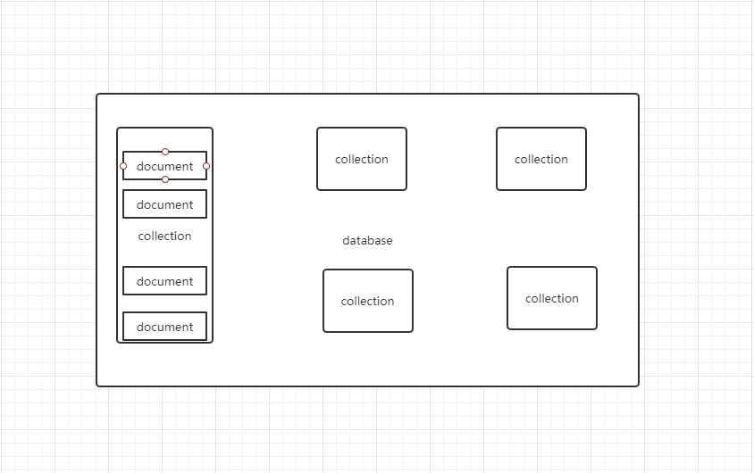

# MongoDB

## 1.安装

详情见官网：

https://docs.mongodb.com/manual/tutorial/install-mongodb-on-windows/

## 2.mongoDB 数据库 、集合 、文档的关系

### 2.1数据库（ database ）

数据库是一个仓库，在中可以存放集合。

## 2.2集合（collection）

集合类似于数组，在集合中可以存放文档

### 2.3文档（document）

文档数据库中最小的单位，存储和操作的内容都是文档

关系图如下：



## 3.数据库基本操作

### 3.1 use

  使用 use 时，如果数据库存在则会进入到相应的数据库，如果不存在则会创建一个新的数据库。插入数据后，这个数据才会真正存在。

### 3.2 CURD操作

```sql
db.<collection name>.insert() 向集合中插入文档

db.<collection name>.find() 查询文档

db.<collection name>.remove() 删除文档

db.<collection name>.update() 修改文档

show dbs
use student
// 插入一条或者多条数据  插入数据如果没有给文档指定_id属性,则数据库会自动_id 作为唯一标识
// _id 可以自己指定但要确唯一
db.student.insert({name:'ywh1',age:'20',gender:'男'})
db.student.insert([
{name:'ywh2',age:'20',gender:'男'},
{name:'ywh3',age:'20',gender:'男'},
{name:'ywh4',age:'20',gender:'男'}])

//只能插入一个
db.student.insertOne({name:'trp',age:'20',gender:'男'})
//只能插入多个
db.student.insertMany([{name:'trp1',age:'20',gender:'男'},
{name:'trp2',age:'20',gender:'男'}])

// 查询操作

// 查询所有的文档
db.student.find()
// 查询符合{}字段属性的文档
db.student.find({age:'20'})

// 查询符合{}字段属性第一个的文档
db.student.findOne({age:'20'})
//查询符合条件文档的总数
db.student.find({age:'20'}).count()
db.student.find({age:'20'}).length()

//修改  update({obj1} {obj2})  使用新对象替代旧对象 
 
// $set 修改指定属性
db.student.update(
    {"_id":ObjectId("5d71c6091338aa937f9b1ce6")},
    {$set:{
      name:'姚伟华' ,age:'10'}}
     )
      
// $unset删除指定属性
db.student.update(
    {"_id":ObjectId("5d71bc2d983726998fce05d2")},
    {$unset:{ gender:'m'}}
    ) 
 // update （updateOne）默认只修改一个文档   updateMany 可以修改多个
db.student.updateMany(
    {name:'ywh1'},
    {   $set:{
        name:"hhhhh1"}
    }) 
 
 mongodb中支持字段名后跟内嵌文档但是查询的时候应当注意
 db.user.find({"hobby.movies":"hero"})
 
 //24.查看numbers集合中的第11条到20条数据
 db.numbers.find().skip(10).limit(10);
/*
    分页 每页显示10条
        1-10     0
        11-20    10
        21-30    20
        。。。
        
        skip((页码-1) * 每页显示的条数).limit(每页显示的条数);
        
    skip()用于跳过指定数量的数据    
    
    MongoDB会自动调整skip和limit的位置
*/
    修改操作
// update 修改多个
 db.student.update(
    {
        name:'hhhhh1'
    },
    {
        $set:{ age:'122'}
    },
    {
        multi:true
    })    
//删除
// deleteOne() deleteMany() remove()第二个参数为true 只会删除一个
db.student.deleteOne({gender:"男"})
db.student.find()
// remove({}) 清空集合但是性能较差   db.student.drop()删除集合 db.dropDatabase() 删除数据库


```


## 4.文档之间的关系

### 4.1 one to one 

```javascript
// 内嵌文档
db.WifeAndHusband.insert([
	{
			name:"黄蓉"
			husband：{
				name：'郭靖'
			}
	}
])
```


### 4.2 one to many

```javascript
//用户 订单
db.users.insert([{
  username:"ywh"
},{
  username:"trp"
}])

db.order.insert([{
   list:["西瓜","苹果","香蕉"],
   user_id:ObjectId("")
}])

//查找用户ywh的订单
var user_id = db.users.findOne({username:"ywh"})._id;
db.order.find({user_id:user_id});

```


### 4.3 many to many


```javascript
db.teachers.insert([
    {name:"洪七公"},
    {name:"黄药师"},
    {name:"龟仙人"}
]);

db.stus.insert([
    {
        name:"郭靖",
        tech_ids:[
            ObjectId("59c4806d241d8d36a1d50de4"),
            ObjectId("59c4806d241d8d36a1d50de5")
        ]
    },{
        name:"孙悟空",
        tech_ids:[
            ObjectId("59c4806d241d8d36a1d50de4"),
            ObjectId("59c4806d241d8d36a1d50de5"),
            ObjectId("59c4806d241d8d36a1d50de6")
        ]
    }
])
```

## 5. sort 和 投影

### 5.1 sort()

```
db.emp.find({}).sort({sal:1}) //升序
db.emp.find({}).sort({sal:-1 , empno:-1}) //降序 sal相同时按empno排序
```

### 5.2投影

```
// 在查询结果中只显示ename _id默认显示  不显示_id{ename:1,_id:0}
db.emp.find({},{ename:1}); 
```

## 6.mongoose

  mongoose是一个可以通过node来操作mongodb的模块，是一个对象文档模型库。对node原生的mongodb模块进行了进一步的封装。

优点：

   可以为文档创建一个模式结构（ 可以为文档创建一个模式结构（ Schema Schema）

   可以对模型中的象 /文档进行验证 文档进行验证 文档进行验证

   数据可以通过类型 转换转换为对象模模型 

  可以使用中间件来应业务逻辑挂钩  

  比Node 原生的 MongoDB驱动更容易 

### 6.1 Schema

 	schema对象定义约束了数据库中的文档结构

```javascript
const mongoose = require('mongoose');
mongoose.connect('mongodb://localhost:27017/student', {
  useNewUrlParser: true
});

//建立连接
mongoose.connection.once("open", function () {
  console.log("数据库已连接");
})
//新建schema
var Schema = mongoose.Schema;

var stuSchema = new Schema({
  name: String,
  age: String,
  gender: {
    type: String,
    default: "男"
  },
});

```


### 6.2 Model

​	Model对象作为集合中的所有文档的表示，相当于MongoDB数据库中的集合collection.

更多方法参考 官方文档https://mongoosejs.com/docs/api/model.html

```javascript
//新建model
var StuModel = mongoose.model('students', stuSchema)

//调用model的方法
StuModel.create({
  name:"wade",
  age:"30",
},function(err){
  if(!err){
    console.log("插入成功")
  }
})
```


### 6.3 Document

  	Document表示集合中的具体文档，相当于集合中的一个具体的文档

更多方法参考 官方文档https://mongoosejs.com/docs/api/document.html

```javascript
const mongoose = require('mongoose');
mongoose.connect('mongodb://localhost:27017/student', {
  useNewUrlParser: true
});

//建立连接
mongoose.connection.once("open", function () {
  console.log("数据库已连接");
})


var Schema = mongoose.Schema;

var stuSchema = new Schema({
  name: String,
  age: String,
  gender: {
    type: String,
    default: "男"
  },
});

var StuModel = mongoose.model('students', stuSchema)
//创建一个document对象
var student = new  StuModel({
  name: "james",
  age:"32",
})

student.save(function(err) {
  if (!err){
    console.log("插入成功");
  }
})
```

